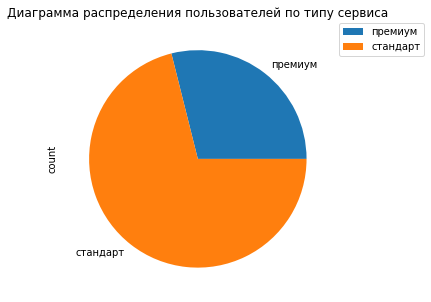
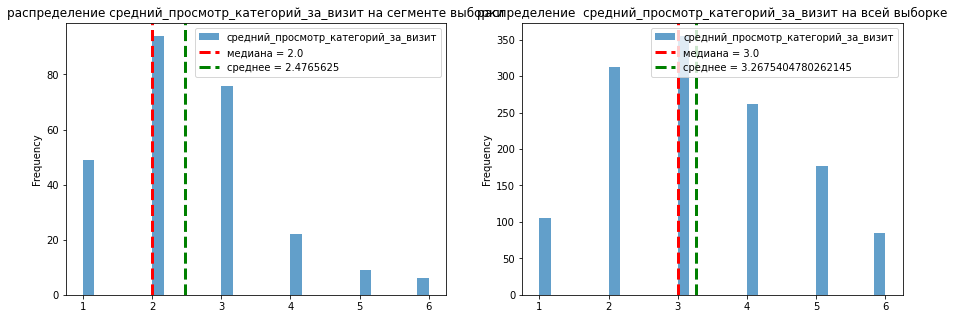

# Введение

В рамках проекта предстоит работать с данными интернет магазина "В один клик" и проанализировать зависимость активности пользователя от имеющихся данных. Для этого необходимо:

1) Обработать данные

2) Провести исследовательский анализ, удалить выбросы и дубликаты при необходимости

3) Провести корреляционный анализ, при необходимости избавиться от мультиколлинеарности

4) Подобрать лучшую модель машинного обучения и лучшие параметры для нее, которые будут давать самый точный результат

5) Обучить модель на тренировочных данных, проверить эффективность на тестовых

6) Проанализировать значимость отдельных признаков на вероятность снижения/повышения покупательской активности, сделать рекоммендации о дальнейшем развитии

# Загрузка данных


```python
!pip install optuna 
!pip install optuna-integration
!pip install -U scikit-learn    
!pip install shap
!pip install matplotlib==3.5.0 -q
```

    Requirement already satisfied: optuna in /opt/conda/lib/python3.9/site-packages (3.6.1)
    Requirement already satisfied: colorlog in /opt/conda/lib/python3.9/site-packages (from optuna) (6.8.2)
    Requirement already satisfied: tqdm in /opt/conda/lib/python3.9/site-packages (from optuna) (4.61.2)
    Requirement already satisfied: alembic>=1.5.0 in /opt/conda/lib/python3.9/site-packages (from optuna) (1.6.5)
    Requirement already satisfied: PyYAML in /opt/conda/lib/python3.9/site-packages (from optuna) (6.0)
    Requirement already satisfied: sqlalchemy>=1.3.0 in /opt/conda/lib/python3.9/site-packages (from optuna) (1.4.20)
    Requirement already satisfied: packaging>=20.0 in /opt/conda/lib/python3.9/site-packages (from optuna) (21.3)
    Requirement already satisfied: numpy in /opt/conda/lib/python3.9/site-packages (from optuna) (1.21.1)
    Requirement already satisfied: python-editor>=0.3 in /opt/conda/lib/python3.9/site-packages (from alembic>=1.5.0->optuna) (1.0.4)
    Requirement already satisfied: Mako in /opt/conda/lib/python3.9/site-packages (from alembic>=1.5.0->optuna) (1.1.4)
    Requirement already satisfied: python-dateutil in /opt/conda/lib/python3.9/site-packages (from alembic>=1.5.0->optuna) (2.8.1)
    Requirement already satisfied: pyparsing!=3.0.5,>=2.0.2 in /opt/conda/lib/python3.9/site-packages (from packaging>=20.0->optuna) (2.4.7)
    Requirement already satisfied: greenlet!=0.4.17 in /opt/conda/lib/python3.9/site-packages (from sqlalchemy>=1.3.0->optuna) (1.1.0)
    Requirement already satisfied: MarkupSafe>=0.9.2 in /opt/conda/lib/python3.9/site-packages (from Mako->alembic>=1.5.0->optuna) (2.1.1)
    Requirement already satisfied: six>=1.5 in /opt/conda/lib/python3.9/site-packages (from python-dateutil->alembic>=1.5.0->optuna) (1.16.0)
    Requirement already satisfied: optuna-integration in /opt/conda/lib/python3.9/site-packages (3.6.0)
    Requirement already satisfied: optuna in /opt/conda/lib/python3.9/site-packages (from optuna-integration) (3.6.1)
    Requirement already satisfied: packaging>=20.0 in /opt/conda/lib/python3.9/site-packages (from optuna->optuna-integration) (21.3)
    Requirement already satisfied: PyYAML in /opt/conda/lib/python3.9/site-packages (from optuna->optuna-integration) (6.0)
    Requirement already satisfied: alembic>=1.5.0 in /opt/conda/lib/python3.9/site-packages (from optuna->optuna-integration) (1.6.5)
    Requirement already satisfied: colorlog in /opt/conda/lib/python3.9/site-packages (from optuna->optuna-integration) (6.8.2)
    Requirement already satisfied: numpy in /opt/conda/lib/python3.9/site-packages (from optuna->optuna-integration) (1.21.1)
    Requirement already satisfied: tqdm in /opt/conda/lib/python3.9/site-packages (from optuna->optuna-integration) (4.61.2)
    Requirement already satisfied: sqlalchemy>=1.3.0 in /opt/conda/lib/python3.9/site-packages (from optuna->optuna-integration) (1.4.20)
    Requirement already satisfied: python-editor>=0.3 in /opt/conda/lib/python3.9/site-packages (from alembic>=1.5.0->optuna->optuna-integration) (1.0.4)
    Requirement already satisfied: Mako in /opt/conda/lib/python3.9/site-packages (from alembic>=1.5.0->optuna->optuna-integration) (1.1.4)
    Requirement already satisfied: python-dateutil in /opt/conda/lib/python3.9/site-packages (from alembic>=1.5.0->optuna->optuna-integration) (2.8.1)
    Requirement already satisfied: pyparsing!=3.0.5,>=2.0.2 in /opt/conda/lib/python3.9/site-packages (from packaging>=20.0->optuna->optuna-integration) (2.4.7)
    Requirement already satisfied: greenlet!=0.4.17 in /opt/conda/lib/python3.9/site-packages (from sqlalchemy>=1.3.0->optuna->optuna-integration) (1.1.0)
    Requirement already satisfied: MarkupSafe>=0.9.2 in /opt/conda/lib/python3.9/site-packages (from Mako->alembic>=1.5.0->optuna->optuna-integration) (2.1.1)
    Requirement already satisfied: six>=1.5 in /opt/conda/lib/python3.9/site-packages (from python-dateutil->alembic>=1.5.0->optuna->optuna-integration) (1.16.0)
    Requirement already satisfied: scikit-learn in /opt/conda/lib/python3.9/site-packages (1.5.1)
    Requirement already satisfied: numpy>=1.19.5 in /opt/conda/lib/python3.9/site-packages (from scikit-learn) (1.21.1)
    Requirement already satisfied: scipy>=1.6.0 in /opt/conda/lib/python3.9/site-packages (from scikit-learn) (1.9.1)
    Requirement already satisfied: threadpoolctl>=3.1.0 in /opt/conda/lib/python3.9/site-packages (from scikit-learn) (3.1.0)
    Requirement already satisfied: joblib>=1.2.0 in /opt/conda/lib/python3.9/site-packages (from scikit-learn) (1.4.2)
    Requirement already satisfied: shap in /opt/conda/lib/python3.9/site-packages (0.46.0)
    Requirement already satisfied: cloudpickle in /opt/conda/lib/python3.9/site-packages (from shap) (3.0.0)
    Requirement already satisfied: numpy in /opt/conda/lib/python3.9/site-packages (from shap) (1.21.1)
    Requirement already satisfied: packaging>20.9 in /opt/conda/lib/python3.9/site-packages (from shap) (21.3)
    Requirement already satisfied: scipy in /opt/conda/lib/python3.9/site-packages (from shap) (1.9.1)
    Requirement already satisfied: tqdm>=4.27.0 in /opt/conda/lib/python3.9/site-packages (from shap) (4.61.2)
    Requirement already satisfied: slicer==0.0.8 in /opt/conda/lib/python3.9/site-packages (from shap) (0.0.8)
    Requirement already satisfied: pandas in /opt/conda/lib/python3.9/site-packages (from shap) (1.2.4)
    Requirement already satisfied: numba in /opt/conda/lib/python3.9/site-packages (from shap) (0.56.0)
    Requirement already satisfied: scikit-learn in /opt/conda/lib/python3.9/site-packages (from shap) (1.5.1)
    Requirement already satisfied: pyparsing!=3.0.5,>=2.0.2 in /opt/conda/lib/python3.9/site-packages (from packaging>20.9->shap) (2.4.7)
    Requirement already satisfied: llvmlite<0.40,>=0.39.0dev0 in /opt/conda/lib/python3.9/site-packages (from numba->shap) (0.39.0)
    Requirement already satisfied: setuptools in /opt/conda/lib/python3.9/site-packages (from numba->shap) (49.6.0.post20210108)
    Requirement already satisfied: python-dateutil>=2.7.3 in /opt/conda/lib/python3.9/site-packages (from pandas->shap) (2.8.1)
    Requirement already satisfied: pytz>=2017.3 in /opt/conda/lib/python3.9/site-packages (from pandas->shap) (2021.1)
    Requirement already satisfied: six>=1.5 in /opt/conda/lib/python3.9/site-packages (from python-dateutil>=2.7.3->pandas->shap) (1.16.0)
    Requirement already satisfied: joblib>=1.2.0 in /opt/conda/lib/python3.9/site-packages (from scikit-learn->shap) (1.4.2)
    Requirement already satisfied: threadpoolctl>=3.1.0 in /opt/conda/lib/python3.9/site-packages (from scikit-learn->shap) (3.1.0)


```python
# импорт необходимых библиотек
import warnings

import pandas as pd
import numpy as np
import matplotlib.pyplot as plt
import seaborn as sns

from sklearn.model_selection import train_test_split, GridSearchCV, RandomizedSearchCV
from optuna.integration import OptunaSearchCV 

from sklearn.pipeline import Pipeline
from sklearn.compose import ColumnTransformer

from sklearn.preprocessing import OneHotEncoder, OrdinalEncoder, StandardScaler, RobustScaler, MinMaxScaler, LabelEncoder

from sklearn.impute import SimpleImputer 

from sklearn.metrics import roc_auc_score, f1_score, make_scorer

from sklearn.neighbors import KNeighborsClassifier
from sklearn.tree import DecisionTreeClassifier
from sklearn.linear_model import LogisticRegression
from sklearn.svm import SVC

from sklearn.inspection import permutation_importance
import shap

from matplotlib.colors import ListedColormap


RANDOM_STATE = 61
TEST_SIZE = 0.25

pd.options.mode.chained_assignment = None
warnings.filterwarnings('ignore')
```


```python
#загрузка таблиц

file_df = pd.read_csv('/datasets/market_file.csv')
money_df = pd.read_csv('/datasets/market_money.csv')
time_df = pd.read_csv('/datasets/market_time.csv')
month_money_df = pd.read_csv('/datasets/money.csv', sep = ';', decimal = ',')

for df in [file_df, money_df, time_df, month_money_df]:
    display(df.head())

```


<div>

<table border="1" class="dataframe">
  <thead>
    <tr style="text-align: right;">
      <th></th>
      <th>id</th>
      <th>Покупательская активность</th>
      <th>Тип сервиса</th>
      <th>Разрешить сообщать</th>
      <th>Маркет_актив_6_мес</th>
      <th>Маркет_актив_тек_мес</th>
      <th>Длительность</th>
      <th>Акционные_покупки</th>
      <th>Популярная_категория</th>
      <th>Средний_просмотр_категорий_за_визит</th>
      <th>Неоплаченные_продукты_штук_квартал</th>
      <th>Ошибка_сервиса</th>
      <th>Страниц_за_визит</th>
    </tr>
  </thead>
  <tbody>
    <tr>
      <th>0</th>
      <td>215348</td>
      <td>Снизилась</td>
      <td>премиум</td>
      <td>да</td>
      <td>3.4</td>
      <td>5</td>
      <td>121</td>
      <td>0.00</td>
      <td>Товары для детей</td>
      <td>6</td>
      <td>2</td>
      <td>1</td>
      <td>5</td>
    </tr>
    <tr>
      <th>1</th>
      <td>215349</td>
      <td>Снизилась</td>
      <td>премиум</td>
      <td>да</td>
      <td>4.4</td>
      <td>4</td>
      <td>819</td>
      <td>0.75</td>
      <td>Товары для детей</td>
      <td>4</td>
      <td>4</td>
      <td>2</td>
      <td>5</td>
    </tr>
    <tr>
      <th>2</th>
      <td>215350</td>
      <td>Снизилась</td>
      <td>стандартт</td>
      <td>нет</td>
      <td>4.9</td>
      <td>3</td>
      <td>539</td>
      <td>0.14</td>
      <td>Домашний текстиль</td>
      <td>5</td>
      <td>2</td>
      <td>1</td>
      <td>5</td>
    </tr>
    <tr>
      <th>3</th>
      <td>215351</td>
      <td>Снизилась</td>
      <td>стандартт</td>
      <td>да</td>
      <td>3.2</td>
      <td>5</td>
      <td>896</td>
      <td>0.99</td>
      <td>Товары для детей</td>
      <td>5</td>
      <td>0</td>
      <td>6</td>
      <td>4</td>
    </tr>
    <tr>
      <th>4</th>
      <td>215352</td>
      <td>Снизилась</td>
      <td>стандартт</td>
      <td>нет</td>
      <td>5.1</td>
      <td>3</td>
      <td>1064</td>
      <td>0.94</td>
      <td>Товары для детей</td>
      <td>3</td>
      <td>2</td>
      <td>3</td>
      <td>2</td>
    </tr>
  </tbody>
</table>
</div>


<div>

<table border="1" class="dataframe">
  <thead>
    <tr style="text-align: right;">
      <th></th>
      <th>id</th>
      <th>Период</th>
      <th>Выручка</th>
    </tr>
  </thead>
  <tbody>
    <tr>
      <th>0</th>
      <td>215348</td>
      <td>препредыдущий_месяц</td>
      <td>0.0</td>
    </tr>
    <tr>
      <th>1</th>
      <td>215348</td>
      <td>текущий_месяц</td>
      <td>3293.1</td>
    </tr>
    <tr>
      <th>2</th>
      <td>215348</td>
      <td>предыдущий_месяц</td>
      <td>0.0</td>
    </tr>
    <tr>
      <th>3</th>
      <td>215349</td>
      <td>препредыдущий_месяц</td>
      <td>4472.0</td>
    </tr>
    <tr>
      <th>4</th>
      <td>215349</td>
      <td>текущий_месяц</td>
      <td>4971.6</td>
    </tr>
  </tbody>
</table>
</div>


<div>

<table border="1" class="dataframe">
  <thead>
    <tr style="text-align: right;">
      <th></th>
      <th>id</th>
      <th>Период</th>
      <th>минут</th>
    </tr>
  </thead>
  <tbody>
    <tr>
      <th>0</th>
      <td>215348</td>
      <td>текущий_месяц</td>
      <td>14</td>
    </tr>
    <tr>
      <th>1</th>
      <td>215348</td>
      <td>предыдцщий_месяц</td>
      <td>13</td>
    </tr>
    <tr>
      <th>2</th>
      <td>215349</td>
      <td>текущий_месяц</td>
      <td>10</td>
    </tr>
    <tr>
      <th>3</th>
      <td>215349</td>
      <td>предыдцщий_месяц</td>
      <td>12</td>
    </tr>
    <tr>
      <th>4</th>
      <td>215350</td>
      <td>текущий_месяц</td>
      <td>13</td>
    </tr>
  </tbody>
</table>
</div>


<div>

<table border="1" class="dataframe">
  <thead>
    <tr style="text-align: right;">
      <th></th>
      <th>id</th>
      <th>Прибыль</th>
    </tr>
  </thead>
  <tbody>
    <tr>
      <th>0</th>
      <td>215348</td>
      <td>0.98</td>
    </tr>
    <tr>
      <th>1</th>
      <td>215349</td>
      <td>4.16</td>
    </tr>
    <tr>
      <th>2</th>
      <td>215350</td>
      <td>3.13</td>
    </tr>
    <tr>
      <th>3</th>
      <td>215351</td>
      <td>4.87</td>
    </tr>
    <tr>
      <th>4</th>
      <td>215352</td>
      <td>4.21</td>
    </tr>
  </tbody>
</table>
</div>


Содержание исходных таблиц соответсвует их описанию

# Предобработка данных

## Переименование столбцов


```python
# приведение названий столбцов к единому виду

file_df = file_df.rename(str.lower, axis = 'columns')\
.rename(columns = {'покупательская активность' : 'покупательская_активность',\
                  'тип сервиса' : 'тип_сервиса', 'разрешить сообщать' : 'разрешить_сообщать'})

money_df = money_df.rename(str.lower, axis = 'columns')

time_df = time_df.rename(str.lower, axis = 'columns')

month_money_df = month_money_df.rename(str.lower, axis = 'columns')

```

Названия столбцов приведены к единому виду: кириллица, без заглавных букв, вместо пробелов - нижние подчёркивания

## Изменение типов данных


```python
for df in [file_df, money_df, time_df, month_money_df]:
    df.info()
    print('---------------------------------------\n---------------------------------------')
```

    <class 'pandas.core.frame.DataFrame'>
    RangeIndex: 1300 entries, 0 to 1299
    Data columns (total 13 columns):
     #   Column                               Non-Null Count  Dtype  
    ---  ------                               --------------  -----  
     0   id                                   1300 non-null   int64  
     1   покупательская_активность            1300 non-null   object 
     2   тип_сервиса                          1300 non-null   object 
     3   разрешить_сообщать                   1300 non-null   object 
     4   маркет_актив_6_мес                   1300 non-null   float64
     5   маркет_актив_тек_мес                 1300 non-null   int64  
     6   длительность                         1300 non-null   int64  
     7   акционные_покупки                    1300 non-null   float64
     8   популярная_категория                 1300 non-null   object 
     9   средний_просмотр_категорий_за_визит  1300 non-null   int64  
     10  неоплаченные_продукты_штук_квартал   1300 non-null   int64  
     11  ошибка_сервиса                       1300 non-null   int64  
     12  страниц_за_визит                     1300 non-null   int64  
    dtypes: float64(2), int64(7), object(4)
    memory usage: 132.2+ KB
    ---------------------------------------
    ---------------------------------------
    <class 'pandas.core.frame.DataFrame'>
    RangeIndex: 3900 entries, 0 to 3899
    Data columns (total 3 columns):
     #   Column   Non-Null Count  Dtype  
    ---  ------   --------------  -----  
     0   id       3900 non-null   int64  
     1   период   3900 non-null   object 
     2   выручка  3900 non-null   float64
    dtypes: float64(1), int64(1), object(1)
    memory usage: 91.5+ KB
    ---------------------------------------
    ---------------------------------------
    <class 'pandas.core.frame.DataFrame'>
    RangeIndex: 2600 entries, 0 to 2599
    Data columns (total 3 columns):
     #   Column  Non-Null Count  Dtype 
    ---  ------  --------------  ----- 
     0   id      2600 non-null   int64 
     1   период  2600 non-null   object
     2   минут   2600 non-null   int64 
    dtypes: int64(2), object(1)
    memory usage: 61.1+ KB
    ---------------------------------------
    ---------------------------------------
    <class 'pandas.core.frame.DataFrame'>
    RangeIndex: 1300 entries, 0 to 1299
    Data columns (total 2 columns):
     #   Column   Non-Null Count  Dtype  
    ---  ------   --------------  -----  
     0   id       1300 non-null   int64  
     1   прибыль  1300 non-null   float64
    dtypes: float64(1), int64(1)
    memory usage: 20.4 KB
    ---------------------------------------
    ---------------------------------------


Все типы данных столбцов определены верно

## Удаление дубликатов

Сначала проверим столбцы с категориальными признаками на предмет дубликатов 


```python
for df in [file_df, money_df, time_df, month_money_df]:
    for col in df.select_dtypes('object').columns:
        print(col + ':', df[col].unique().tolist())
    print('---------------------------------------')

file_df['тип_сервиса'] = file_df['тип_сервиса'].str.replace('стандартт', 'стандарт')
money_df['период'] = money_df['период'].str.replace('препредыдущий_месяц', 'предпредыдущий_месяц')
time_df['период'] = time_df['период'].str.replace('предыдцщий_месяц', 'предыдущий_месяц')

file_df['покупательская_активность'] = file_df['покупательская_активность'].str.replace(' ', '_').str.lower()
file_df['популярная_категория'] = file_df['популярная_категория'].str.replace(' ', '_').str.lower()

print("\n После исправления:\n")

for df in [file_df, money_df, time_df, month_money_df]:
    for col in df.select_dtypes('object').columns:
        print(col + ':', df[col].unique().tolist())
    print('---------------------------------------')
```

    покупательская_активность: ['Снизилась', 'Прежний уровень']
    тип_сервиса: ['премиум', 'стандартт', 'стандарт']
    разрешить_сообщать: ['да', 'нет']
    популярная_категория: ['Товары для детей', 'Домашний текстиль', 'Косметика и аксесуары', 'Техника для красоты и здоровья', 'Кухонная посуда', 'Мелкая бытовая техника и электроника']
    ---------------------------------------
    период: ['препредыдущий_месяц', 'текущий_месяц', 'предыдущий_месяц']
    ---------------------------------------
    период: ['текущий_месяц', 'предыдцщий_месяц']
    ---------------------------------------
    ---------------------------------------
    
     После исправления:
    
    покупательская_активность: ['снизилась', 'прежний_уровень']
    тип_сервиса: ['премиум', 'стандарт']
    разрешить_сообщать: ['да', 'нет']
    популярная_категория: ['товары_для_детей', 'домашний_текстиль', 'косметика_и_аксесуары', 'техника_для_красоты_и_здоровья', 'кухонная_посуда', 'мелкая_бытовая_техника_и_электроника']
    ---------------------------------------
    период: ['предпредыдущий_месяц', 'текущий_месяц', 'предыдущий_месяц']
    ---------------------------------------
    период: ['текущий_месяц', 'предыдущий_месяц']
    ---------------------------------------
    ---------------------------------------


Были обнаружены следующие ошибки:

* Опечатки в столбце *тип_сервиса* таблицы *file_df*: у некоторых пользователей был отмечен тип "стандартт" вместо "стандарт"

* Опечатки в столбце *период* таблицы *time_df*: вместо значения "предыдущий месяц" было "предыдцщий месяц"

Также дополнительно все категории были приведены к единому виду, аналогичному виду названий столбцов

Теперь удалим полные дубликаты, если они есть


```python
print('Размеры таблиц до удаления дубликатов:')
for df in [file_df, money_df, time_df, month_money_df]:
    print(df.shape)

file_df = file_df.drop_duplicates()
money_df = money_df.drop_duplicates()
time_df = time_df.drop_duplicates()
month_money_df = month_money_df.drop_duplicates()

print('\nРазмеры таблиц после удаления дубликатов:')
for df in [file_df, money_df, time_df, month_money_df]:
    print(df.shape)
```

    Размеры таблиц до удаления дубликатов:
    (1300, 13)
    (3900, 3)
    (2600, 3)
    (1300, 2)
    
    Размеры таблиц после удаления дубликатов:
    (1300, 13)
    (3900, 3)
    (2600, 3)
    (1300, 2)


Полных дубликатов не обнаружено

## Изменение индексов таблиц

Поменяем индексы строк основной таблицы на id клиентов: этот признак бесполезен при анализе, а также это действие упростит дальнейшее слияние таблиц


```python
file_df = file_df.set_index('id')
month_money_df = month_money_df.set_index('id')

for df in [file_df, money_df, time_df, month_money_df]:
    display(df.head())
```


<div>

<table border="1" class="dataframe">
  <thead>
    <tr style="text-align: right;">
      <th></th>
      <th>покупательская_активность</th>
      <th>тип_сервиса</th>
      <th>разрешить_сообщать</th>
      <th>маркет_актив_6_мес</th>
      <th>маркет_актив_тек_мес</th>
      <th>длительность</th>
      <th>акционные_покупки</th>
      <th>популярная_категория</th>
      <th>средний_просмотр_категорий_за_визит</th>
      <th>неоплаченные_продукты_штук_квартал</th>
      <th>ошибка_сервиса</th>
      <th>страниц_за_визит</th>
    </tr>
    <tr>
      <th>id</th>
      <th></th>
      <th></th>
      <th></th>
      <th></th>
      <th></th>
      <th></th>
      <th></th>
      <th></th>
      <th></th>
      <th></th>
      <th></th>
      <th></th>
    </tr>
  </thead>
  <tbody>
    <tr>
      <th>215348</th>
      <td>снизилась</td>
      <td>премиум</td>
      <td>да</td>
      <td>3.4</td>
      <td>5</td>
      <td>121</td>
      <td>0.00</td>
      <td>товары_для_детей</td>
      <td>6</td>
      <td>2</td>
      <td>1</td>
      <td>5</td>
    </tr>
    <tr>
      <th>215349</th>
      <td>снизилась</td>
      <td>премиум</td>
      <td>да</td>
      <td>4.4</td>
      <td>4</td>
      <td>819</td>
      <td>0.75</td>
      <td>товары_для_детей</td>
      <td>4</td>
      <td>4</td>
      <td>2</td>
      <td>5</td>
    </tr>
    <tr>
      <th>215350</th>
      <td>снизилась</td>
      <td>стандарт</td>
      <td>нет</td>
      <td>4.9</td>
      <td>3</td>
      <td>539</td>
      <td>0.14</td>
      <td>домашний_текстиль</td>
      <td>5</td>
      <td>2</td>
      <td>1</td>
      <td>5</td>
    </tr>
    <tr>
      <th>215351</th>
      <td>снизилась</td>
      <td>стандарт</td>
      <td>да</td>
      <td>3.2</td>
      <td>5</td>
      <td>896</td>
      <td>0.99</td>
      <td>товары_для_детей</td>
      <td>5</td>
      <td>0</td>
      <td>6</td>
      <td>4</td>
    </tr>
    <tr>
      <th>215352</th>
      <td>снизилась</td>
      <td>стандарт</td>
      <td>нет</td>
      <td>5.1</td>
      <td>3</td>
      <td>1064</td>
      <td>0.94</td>
      <td>товары_для_детей</td>
      <td>3</td>
      <td>2</td>
      <td>3</td>
      <td>2</td>
    </tr>
  </tbody>
</table>
</div>


<div>

<table border="1" class="dataframe">
  <thead>
    <tr style="text-align: right;">
      <th></th>
      <th>id</th>
      <th>период</th>
      <th>выручка</th>
    </tr>
  </thead>
  <tbody>
    <tr>
      <th>0</th>
      <td>215348</td>
      <td>предпредыдущий_месяц</td>
      <td>0.0</td>
    </tr>
    <tr>
      <th>1</th>
      <td>215348</td>
      <td>текущий_месяц</td>
      <td>3293.1</td>
    </tr>
    <tr>
      <th>2</th>
      <td>215348</td>
      <td>предыдущий_месяц</td>
      <td>0.0</td>
    </tr>
    <tr>
      <th>3</th>
      <td>215349</td>
      <td>предпредыдущий_месяц</td>
      <td>4472.0</td>
    </tr>
    <tr>
      <th>4</th>
      <td>215349</td>
      <td>текущий_месяц</td>
      <td>4971.6</td>
    </tr>
  </tbody>
</table>
</div>


<div>

<table border="1" class="dataframe">
  <thead>
    <tr style="text-align: right;">
      <th></th>
      <th>id</th>
      <th>период</th>
      <th>минут</th>
    </tr>
  </thead>
  <tbody>
    <tr>
      <th>0</th>
      <td>215348</td>
      <td>текущий_месяц</td>
      <td>14</td>
    </tr>
    <tr>
      <th>1</th>
      <td>215348</td>
      <td>предыдущий_месяц</td>
      <td>13</td>
    </tr>
    <tr>
      <th>2</th>
      <td>215349</td>
      <td>текущий_месяц</td>
      <td>10</td>
    </tr>
    <tr>
      <th>3</th>
      <td>215349</td>
      <td>предыдущий_месяц</td>
      <td>12</td>
    </tr>
    <tr>
      <th>4</th>
      <td>215350</td>
      <td>текущий_месяц</td>
      <td>13</td>
    </tr>
  </tbody>
</table>
</div>


<div>

<table border="1" class="dataframe">
  <thead>
    <tr style="text-align: right;">
      <th></th>
      <th>прибыль</th>
    </tr>
    <tr>
      <th>id</th>
      <th></th>
    </tr>
  </thead>
  <tbody>
    <tr>
      <th>215348</th>
      <td>0.98</td>
    </tr>
    <tr>
      <th>215349</th>
      <td>4.16</td>
    </tr>
    <tr>
      <th>215350</th>
      <td>3.13</td>
    </tr>
    <tr>
      <th>215351</th>
      <td>4.87</td>
    </tr>
    <tr>
      <th>215352</th>
      <td>4.21</td>
    </tr>
  </tbody>
</table>
</div>


# Исследовательский анализ данных

## Удаление неактуальных данных

В первую очередь нужно избавиться от неактуальных данных, а именно удалить из таблиц клиентов с покупательской активностью менее 3 месяцев. Взять эту информацию можно из таблицы *money_df* - если в столбце *выручка* нулевое значение при значении *период* - *предпредыдущий_месяц*, то эти пользователи новые и их следует убрать


```python
irrelevant_clients = money_df.query('выручка == 0 and период == "предпредыдущий_месяц"')['id'].tolist()
print(irrelevant_clients)
file_df = file_df.query('id != 215348 and id != 215357 and id != 215359')
money_df = money_df.query('id != 215348 and id != 215357 and id != 215359')
time_df = time_df.query('id != 215348 and id != 215357 and id != 215359')
month_money_df = month_money_df.query('id != 215348 and id != 215357 and id != 215359')
```

    [215348, 215357, 215359]


Как мы видим, таких клиентов в таблице 3 штуки. Удалим их из выборки

## Таблица *file_df*

### Статистический анализ


```python
file_df.describe()
```


<div>

<table border="1" class="dataframe">
  <thead>
    <tr style="text-align: right;">
      <th></th>
      <th>маркет_актив_6_мес</th>
      <th>маркет_актив_тек_мес</th>
      <th>длительность</th>
      <th>акционные_покупки</th>
      <th>средний_просмотр_категорий_за_визит</th>
      <th>неоплаченные_продукты_штук_квартал</th>
      <th>ошибка_сервиса</th>
      <th>страниц_за_визит</th>
    </tr>
  </thead>
  <tbody>
    <tr>
      <th>count</th>
      <td>1297.000000</td>
      <td>1297.000000</td>
      <td>1297.000000</td>
      <td>1297.000000</td>
      <td>1297.000000</td>
      <td>1297.000000</td>
      <td>1297.000000</td>
      <td>1297.000000</td>
    </tr>
    <tr>
      <th>mean</th>
      <td>4.254433</td>
      <td>4.009252</td>
      <td>602.993832</td>
      <td>0.320547</td>
      <td>3.267540</td>
      <td>2.841172</td>
      <td>4.184271</td>
      <td>8.186584</td>
    </tr>
    <tr>
      <th>std</th>
      <td>1.015618</td>
      <td>0.696048</td>
      <td>249.101456</td>
      <td>0.249657</td>
      <td>1.354623</td>
      <td>1.973451</td>
      <td>1.950973</td>
      <td>3.977061</td>
    </tr>
    <tr>
      <th>min</th>
      <td>0.900000</td>
      <td>3.000000</td>
      <td>121.000000</td>
      <td>0.110000</td>
      <td>1.000000</td>
      <td>0.000000</td>
      <td>0.000000</td>
      <td>1.000000</td>
    </tr>
    <tr>
      <th>25%</th>
      <td>3.700000</td>
      <td>4.000000</td>
      <td>410.000000</td>
      <td>0.170000</td>
      <td>2.000000</td>
      <td>1.000000</td>
      <td>3.000000</td>
      <td>5.000000</td>
    </tr>
    <tr>
      <th>50%</th>
      <td>4.200000</td>
      <td>4.000000</td>
      <td>607.000000</td>
      <td>0.240000</td>
      <td>3.000000</td>
      <td>3.000000</td>
      <td>4.000000</td>
      <td>8.000000</td>
    </tr>
    <tr>
      <th>75%</th>
      <td>4.900000</td>
      <td>4.000000</td>
      <td>806.000000</td>
      <td>0.300000</td>
      <td>4.000000</td>
      <td>4.000000</td>
      <td>6.000000</td>
      <td>11.000000</td>
    </tr>
    <tr>
      <th>max</th>
      <td>6.600000</td>
      <td>5.000000</td>
      <td>1079.000000</td>
      <td>0.990000</td>
      <td>6.000000</td>
      <td>10.000000</td>
      <td>9.000000</td>
      <td>20.000000</td>
    </tr>
  </tbody>
</table>
</div>


Аномальных выбросов в данных не обнаружено

### Анализ количественных признаков


```python
def show_hist_boxplot(df,sign, bins, title1, title2): #выводит изображение гистограммы с отмеченными медианой и средним и ящик с усами
    #plt_hist, plt_box = plt.subplots(nrows=1, ncols=2)
    plt.rcParams ['figure.figsize'] = [15, 5]
    plt.subplot(1, 2, 1)
    df[sign].plot(kind = 'hist', bins = bins, alpha = 0.7, title = title1)
    plt.axvline(x=np.nanmedian (df[sign]), color='red', linestyle='--', linewidth= 3 , label='медиана') 
    plt.axvline(x=np.nanmean (df[sign]), color='green', linestyle='--', linewidth= 3 , label='среднее') 
    plt.legend()
    plt.subplot(1, 2, 2)
    df.boxplot(sign)
    plt.title(title2)
    plt.show()    
```

#### Столбец *маркет_актив\_6\_мес*


```python
show_hist_boxplot(file_df, 'маркет_актив_6_мес', 30, 'Гистограмма распределения активности пользователей за 6 месяцев', 'Диаграмма размаха активности пользователей за 6 месяцев')
```


    

    


#### Столбец *маркет_актив_тек_мес*


```python
show_hist_boxplot(file_df, 'маркет_актив_тек_мес', 10, 'Гистограмма распределения количества маркетинговых коммуникаций', 'Диаграмма размаха количества маркетинговых коммуникаций')
```


    

    


Как мы видим, у признака всего 3 значения, так что гистограмма не особо информативная

#### Столбец *длительность*


```python
show_hist_boxplot(file_df, 'длительность', 40, 'Гистограмма распределения времени существования аккаунтов', 'Диаграмма размаха времени существования аккаунтов')
```


    

    


#### Столбец *акционные_покупки*


```python
show_hist_boxplot(file_df, 'акционные_покупки', 30, 'Гистограмма распределения среднемесячной доли покупок по акции', 'Диаграмма размаха среднемесячной доли покупок по акции')
```


    

    


На лицо бимодальность признака

#### Столбец *средний_просмотр_категорий_за_визит*


```python
show_hist_boxplot(file_df, 'средний_просмотр_категорий_за_визит', 30, 'Гистограмма распределения ср. кол-ва категорий за визит', 'Диаграмма размаха ср. кол-ва категорий за визит')
```


    

    


#### Столбец *неоплаченные_продукты_штук_квартал*


```python
show_hist_boxplot(file_df, 'неоплаченные_продукты_штук_квартал', 30, 'Гистограмма распределения кол-ва неоплаченных продуктов', 'Диаграмма размаха кол-ва неоплаченных продукто')
```


    

    


#### Столбец *ошибка_сервиса*


```python
show_hist_boxplot(file_df, 'ошибка_сервиса', 30, 'Гистограмма распределения числа сбоев, коснувшихся клиента', 'Диаграмма размаха числа сбоев, коснувшихся клиента')
```


    

    


#### Столбец *страниц_за_визит*


```python
show_hist_boxplot(file_df, 'страниц_за_визит', 30, 'Гистограмма распределения ср. кол-ва просматриваемых страниц', 'Диаграмма размаха ср. кол-ва просматриваемых страниц')
```


    

    


Большинство количественных признаков имеет форму распределения, близкую к нормальному, кроме:

* Признака *акционные_покупки*, обладающего бимодальным распределением, возможно, в дальнейшем стоит перевести этот признак в числовой *доля_акционных_покупок* со значениями "низкая" и "высокая"

* Признака *неоплаченные_продукты*, который скорее имеет распределение, близкое к Пуассоновскому (что логично, ведь неоплаченный продукт - это скорее ошибка, чем норма)

### Анализ категориальных признаков


```python
def show_pie(df, col, val, tit, loc = 'best'):
    temp = pd.pivot_table(df, index = col, values = val, aggfunc = 'count')
    temp.columns = ['count']
    temp['percentage'] = temp['count']/len(df)
    temp.plot(kind = 'pie', y = 'count', title = tit)
    display(temp)
    plt.legend(bbox_to_anchor=( 1.02 , 1 ), loc=loc, borderaxespad= 0)
    plt.show()

def show_bar(df, col, val, tit, loc = 'best'):
    temp = pd.pivot_table(df, index = col, values = val, aggfunc = 'count')
    temp.columns = ['count']
    temp['percentage'] = temp['count']/len(df)
    temp = temp.sort_values(by = 'count')
    temp.plot(kind = 'bar', y = 'count', title = tit)
    display(temp)
    plt.legend(bbox_to_anchor=( 1.02 , 1 ), loc=loc, borderaxespad= 0)
    plt.show()
```

#### Столбец *покупательская_активность*


```python
show_pie(file_df, 'покупательская_активность', 'длительность', 'Диаграмма распределения пользователей по покупательской активности')
```


<div>

<table border="1" class="dataframe">
  <thead>
    <tr style="text-align: right;">
      <th></th>
      <th>count</th>
      <th>percentage</th>
    </tr>
    <tr>
      <th>покупательская_активность</th>
      <th></th>
      <th></th>
    </tr>
  </thead>
  <tbody>
    <tr>
      <th>прежний_уровень</th>
      <td>802</td>
      <td>0.61835</td>
    </tr>
    <tr>
      <th>снизилась</th>
      <td>495</td>
      <td>0.38165</td>
    </tr>
  </tbody>
</table>
</div>


    

    


#### Столбец *тип_сервиса*


```python
show_pie(file_df, 'тип_сервиса', 'длительность', 'Диаграмма распределения пользователей по типу сервиса')
```


<div>

<table border="1" class="dataframe">
  <thead>
    <tr style="text-align: right;">
      <th></th>
      <th>count</th>
      <th>percentage</th>
    </tr>
    <tr>
      <th>тип_сервиса</th>
      <th></th>
      <th></th>
    </tr>
  </thead>
  <tbody>
    <tr>
      <th>премиум</th>
      <td>375</td>
      <td>0.289129</td>
    </tr>
    <tr>
      <th>стандарт</th>
      <td>922</td>
      <td>0.710871</td>
    </tr>
  </tbody>
</table>
</div>


    

    


#### Столбец *разрешить_сообщать*


```python
show_pie(file_df, 'разрешить_сообщать', 'длительность', 'Диаграмма распределения пользователей по возможности присылать доп. информацию')
```


<div>

<table border="1" class="dataframe">
  <thead>
    <tr style="text-align: right;">
      <th></th>
      <th>count</th>
      <th>percentage</th>
    </tr>
    <tr>
      <th>разрешить_сообщать</th>
      <th></th>
      <th></th>
    </tr>
  </thead>
  <tbody>
    <tr>
      <th>да</th>
      <td>959</td>
      <td>0.739399</td>
    </tr>
    <tr>
      <th>нет</th>
      <td>338</td>
      <td>0.260601</td>
    </tr>
  </tbody>
</table>
</div>


    

    


#### Столбец *популярная_категория*


```python
show_bar(file_df, 'популярная_категория', 'длительность', 'Диаграмма распределения пользователей по самой популярной категории товаров')
```


<div>

<table border="1" class="dataframe">
  <thead>
    <tr style="text-align: right;">
      <th></th>
      <th>count</th>
      <th>percentage</th>
    </tr>
    <tr>
      <th>популярная_категория</th>
      <th></th>
      <th></th>
    </tr>
  </thead>
  <tbody>
    <tr>
      <th>кухонная_посуда</th>
      <td>138</td>
      <td>0.106399</td>
    </tr>
    <tr>
      <th>мелкая_бытовая_техника_и_электроника</th>
      <td>174</td>
      <td>0.134156</td>
    </tr>
    <tr>
      <th>техника_для_красоты_и_здоровья</th>
      <td>183</td>
      <td>0.141095</td>
    </tr>
    <tr>
      <th>косметика_и_аксесуары</th>
      <td>223</td>
      <td>0.171935</td>
    </tr>
    <tr>
      <th>домашний_текстиль</th>
      <td>250</td>
      <td>0.192753</td>
    </tr>
    <tr>
      <th>товары_для_детей</th>
      <td>329</td>
      <td>0.253662</td>
    </tr>
  </tbody>
</table>
</div>


    

    


Как мы видим, пользователи распределены не равномерно по каждому из категориальных признаков, что нужно будет учесть при разделении на тренировочную и валидационную выборки

## Таблица *money_df*

### Статистический анализ


```python
display(money_df.describe())
display(money_df.query('выручка > 10000'))
money_df.loc[money_df['выручка'] > 10000, 'выручка'] = money_df.loc[money_df['период'] == 'текущий_месяц', 'выручка'].median()
display(money_df.query('id == 215380'))
```


<div>

<table border="1" class="dataframe">
  <thead>
    <tr style="text-align: right;">
      <th></th>
      <th>id</th>
      <th>выручка</th>
    </tr>
  </thead>
  <tbody>
    <tr>
      <th>count</th>
      <td>3891.000000</td>
      <td>3891.000000</td>
    </tr>
    <tr>
      <th>mean</th>
      <td>215998.986893</td>
      <td>5033.718890</td>
    </tr>
    <tr>
      <th>std</th>
      <td>374.482249</td>
      <td>1768.471286</td>
    </tr>
    <tr>
      <th>min</th>
      <td>215349.000000</td>
      <td>2758.700000</td>
    </tr>
    <tr>
      <th>25%</th>
      <td>215675.000000</td>
      <td>4592.000000</td>
    </tr>
    <tr>
      <th>50%</th>
      <td>215999.000000</td>
      <td>4959.000000</td>
    </tr>
    <tr>
      <th>75%</th>
      <td>216323.000000</td>
      <td>5363.200000</td>
    </tr>
    <tr>
      <th>max</th>
      <td>216647.000000</td>
      <td>106862.200000</td>
    </tr>
  </tbody>
</table>
</div>


<div>

<table border="1" class="dataframe">
  <thead>
    <tr style="text-align: right;">
      <th></th>
      <th>id</th>
      <th>период</th>
      <th>выручка</th>
    </tr>
  </thead>
  <tbody>
    <tr>
      <th>98</th>
      <td>215380</td>
      <td>текущий_месяц</td>
      <td>106862.2</td>
    </tr>
  </tbody>
</table>
</div>


<div>

<table border="1" class="dataframe">
  <thead>
    <tr style="text-align: right;">
      <th></th>
      <th>id</th>
      <th>период</th>
      <th>выручка</th>
    </tr>
  </thead>
  <tbody>
    <tr>
      <th>96</th>
      <td>215380</td>
      <td>предпредыдущий_месяц</td>
      <td>5051.0</td>
    </tr>
    <tr>
      <th>97</th>
      <td>215380</td>
      <td>предыдущий_месяц</td>
      <td>6077.0</td>
    </tr>
    <tr>
      <th>98</th>
      <td>215380</td>
      <td>текущий_месяц</td>
      <td>5180.3</td>
    </tr>
  </tbody>
</table>
</div>


### Столбец *период*


```python
show_pie(money_df, 'период', 'id', 'распределение пользователей по периоду фиксации данных')
```


<div>

<table border="1" class="dataframe">
  <thead>
    <tr style="text-align: right;">
      <th></th>
      <th>count</th>
      <th>percentage</th>
    </tr>
    <tr>
      <th>период</th>
      <th></th>
      <th></th>
    </tr>
  </thead>
  <tbody>
    <tr>
      <th>предпредыдущий_месяц</th>
      <td>1297</td>
      <td>0.333333</td>
    </tr>
    <tr>
      <th>предыдущий_месяц</th>
      <td>1297</td>
      <td>0.333333</td>
    </tr>
    <tr>
      <th>текущий_месяц</th>
      <td>1297</td>
      <td>0.333333</td>
    </tr>
  </tbody>
</table>
</div>


    

    


Данные по признаку распределены равномерно, что логично: для каждого пользователя были зафиксированы данные о выручке в каждый из 3 последних месяцев

### Столбец *выручка*


```python
show_hist_boxplot(money_df, 'выручка', 30, 'Гистограмма распределения месячной выручки', 'Диаграмма размаха месячной выручки')
```


    

    


Распределение близко к нормальному, но на диаграмме размаха видно множество выбросов (хвосты не влезают в размах)

## Таблица *time_df*

### Статистический анализ


```python
time_df.info()
time_df.describe()
```

    <class 'pandas.core.frame.DataFrame'>
    Int64Index: 2594 entries, 2 to 2599
    Data columns (total 3 columns):
     #   Column  Non-Null Count  Dtype 
    ---  ------  --------------  ----- 
     0   id      2594 non-null   int64 
     1   период  2594 non-null   object
     2   минут   2594 non-null   int64 
    dtypes: int64(2), object(1)
    memory usage: 81.1+ KB


<div>

<table border="1" class="dataframe">
  <thead>
    <tr style="text-align: right;">
      <th></th>
      <th>id</th>
      <th>минут</th>
    </tr>
  </thead>
  <tbody>
    <tr>
      <th>count</th>
      <td>2594.000000</td>
      <td>2594.000000</td>
    </tr>
    <tr>
      <th>mean</th>
      <td>215998.986893</td>
      <td>13.340401</td>
    </tr>
    <tr>
      <th>std</th>
      <td>374.506318</td>
      <td>4.081999</td>
    </tr>
    <tr>
      <th>min</th>
      <td>215349.000000</td>
      <td>4.000000</td>
    </tr>
    <tr>
      <th>25%</th>
      <td>215675.000000</td>
      <td>10.000000</td>
    </tr>
    <tr>
      <th>50%</th>
      <td>215999.000000</td>
      <td>13.000000</td>
    </tr>
    <tr>
      <th>75%</th>
      <td>216323.000000</td>
      <td>16.000000</td>
    </tr>
    <tr>
      <th>max</th>
      <td>216647.000000</td>
      <td>23.000000</td>
    </tr>
  </tbody>
</table>
</div>


Явных выбросов и аномальных значений не видно

### Столбец *период*


```python
show_pie(time_df, 'период', 'id', 'распределение пользователей по периоду фиксации данных')
```


<div>

<table border="1" class="dataframe">
  <thead>
    <tr style="text-align: right;">
      <th></th>
      <th>count</th>
      <th>percentage</th>
    </tr>
    <tr>
      <th>период</th>
      <th></th>
      <th></th>
    </tr>
  </thead>
  <tbody>
    <tr>
      <th>предыдущий_месяц</th>
      <td>1297</td>
      <td>0.5</td>
    </tr>
    <tr>
      <th>текущий_месяц</th>
      <td>1297</td>
      <td>0.5</td>
    </tr>
  </tbody>
</table>
</div>


    

    


Для каждого пользователя имеются данные как за текущий, так и за предыдущий месяц

### Столбец *минут*


```python
show_hist_boxplot(time_df, 'минут', 20, 'Гистограмма распределения времени, проведенного на сайте за месяц', 'Диаграмма размаха времени, проведенного на сайте за месяц')
```


    

    


Распределение близко к нормальному

## Таблица *month_money_df*

### Статистический анализ


```python
month_money_df.describe()
```


<div>

<table border="1" class="dataframe">
  <thead>
    <tr style="text-align: right;">
      <th></th>
      <th>прибыль</th>
    </tr>
  </thead>
  <tbody>
    <tr>
      <th>count</th>
      <td>1297.000000</td>
    </tr>
    <tr>
      <th>mean</th>
      <td>3.997610</td>
    </tr>
    <tr>
      <th>std</th>
      <td>1.010813</td>
    </tr>
    <tr>
      <th>min</th>
      <td>0.860000</td>
    </tr>
    <tr>
      <th>25%</th>
      <td>3.300000</td>
    </tr>
    <tr>
      <th>50%</th>
      <td>4.040000</td>
    </tr>
    <tr>
      <th>75%</th>
      <td>4.670000</td>
    </tr>
    <tr>
      <th>max</th>
      <td>7.430000</td>
    </tr>
  </tbody>
</table>
</div>


Явных выбросов не замечено

### Столбец прибыль


```python
show_hist_boxplot(month_money_df, 'прибыль', 20, 'Гистограмма распределения среднемесячной прибыли за 3 месяца', 'Диаграмма размаха среднемесячной прибыли за 3 месяца')
```


    

    


Распределение близко к нормальному, хоть и видно немного выбросов с обеих сторон

# Объединение таблиц

Объединим таблицы следующим образом: 
* Разделяем значения выручки и времени на сайте по месяцам (т.е. получаем столбцы *выручка_текущий_месяц*, *выручка_предыдущий_месяц*, *выручка_предпредыдущий_месяц*, *минуты_текщий месяц*, *минуты_предыдущий_месяц*)

* Присоединяем столбцы таблиц *money_df* и *time_df* к таблице *file_df*


```python
# изменение столбцов

temp_df = []

for age in ["текущий_месяц", "предыдущий_месяц", "предпредыдущий_месяц"]:
    temp_df.append(money_df.query('период == @age'))
    del temp_df[-1]['период']
    temp_df[-1].columns = ["id", "выручка_"+age]
    temp_df[-1] = temp_df[-1].set_index('id')

for age in ["текущий_месяц", "предыдущий_месяц"]:
    temp_df.append(time_df.query('период == @age'))
    del temp_df[-1]['период']
    temp_df[-1].columns = ["id", "минуты_"+age]
    temp_df[-1] = temp_df[-1].set_index('id')

for df in temp_df:
    display(df.head())
```


<div>

<table border="1" class="dataframe">
  <thead>
    <tr style="text-align: right;">
      <th></th>
      <th>выручка_текущий_месяц</th>
    </tr>
    <tr>
      <th>id</th>
      <th></th>
    </tr>
  </thead>
  <tbody>
    <tr>
      <th>215349</th>
      <td>4971.6</td>
    </tr>
    <tr>
      <th>215350</th>
      <td>5058.4</td>
    </tr>
    <tr>
      <th>215351</th>
      <td>6610.4</td>
    </tr>
    <tr>
      <th>215352</th>
      <td>5872.5</td>
    </tr>
    <tr>
      <th>215353</th>
      <td>5388.5</td>
    </tr>
  </tbody>
</table>
</div>


<div>

<table border="1" class="dataframe">
  <thead>
    <tr style="text-align: right;">
      <th></th>
      <th>выручка_предыдущий_месяц</th>
    </tr>
    <tr>
      <th>id</th>
      <th></th>
    </tr>
  </thead>
  <tbody>
    <tr>
      <th>215349</th>
      <td>5216.0</td>
    </tr>
    <tr>
      <th>215350</th>
      <td>5457.5</td>
    </tr>
    <tr>
      <th>215351</th>
      <td>6158.0</td>
    </tr>
    <tr>
      <th>215352</th>
      <td>5807.5</td>
    </tr>
    <tr>
      <th>215353</th>
      <td>4738.5</td>
    </tr>
  </tbody>
</table>
</div>


<div>

<table border="1" class="dataframe">
  <thead>
    <tr style="text-align: right;">
      <th></th>
      <th>выручка_предпредыдущий_месяц</th>
    </tr>
    <tr>
      <th>id</th>
      <th></th>
    </tr>
  </thead>
  <tbody>
    <tr>
      <th>215349</th>
      <td>4472.0</td>
    </tr>
    <tr>
      <th>215350</th>
      <td>4826.0</td>
    </tr>
    <tr>
      <th>215351</th>
      <td>4793.0</td>
    </tr>
    <tr>
      <th>215352</th>
      <td>4594.0</td>
    </tr>
    <tr>
      <th>215353</th>
      <td>5124.0</td>
    </tr>
  </tbody>
</table>
</div>


<div>

<table border="1" class="dataframe">
  <thead>
    <tr style="text-align: right;">
      <th></th>
      <th>минуты_текущий_месяц</th>
    </tr>
    <tr>
      <th>id</th>
      <th></th>
    </tr>
  </thead>
  <tbody>
    <tr>
      <th>215349</th>
      <td>10</td>
    </tr>
    <tr>
      <th>215350</th>
      <td>13</td>
    </tr>
    <tr>
      <th>215351</th>
      <td>13</td>
    </tr>
    <tr>
      <th>215352</th>
      <td>11</td>
    </tr>
    <tr>
      <th>215353</th>
      <td>10</td>
    </tr>
  </tbody>
</table>
</div>


<div>

<table border="1" class="dataframe">
  <thead>
    <tr style="text-align: right;">
      <th></th>
      <th>минуты_предыдущий_месяц</th>
    </tr>
    <tr>
      <th>id</th>
      <th></th>
    </tr>
  </thead>
  <tbody>
    <tr>
      <th>215349</th>
      <td>12</td>
    </tr>
    <tr>
      <th>215350</th>
      <td>8</td>
    </tr>
    <tr>
      <th>215351</th>
      <td>11</td>
    </tr>
    <tr>
      <th>215352</th>
      <td>8</td>
    </tr>
    <tr>
      <th>215353</th>
      <td>10</td>
    </tr>
  </tbody>
</table>
</div>


```python
main_df = file_df.join(temp_df)
main_df.head()
```


<div>

<table border="1" class="dataframe">
  <thead>
    <tr style="text-align: right;">
      <th></th>
      <th>покупательская_активность</th>
      <th>тип_сервиса</th>
      <th>разрешить_сообщать</th>
      <th>маркет_актив_6_мес</th>
      <th>маркет_актив_тек_мес</th>
      <th>длительность</th>
      <th>акционные_покупки</th>
      <th>популярная_категория</th>
      <th>средний_просмотр_категорий_за_визит</th>
      <th>неоплаченные_продукты_штук_квартал</th>
      <th>ошибка_сервиса</th>
      <th>страниц_за_визит</th>
      <th>выручка_текущий_месяц</th>
      <th>выручка_предыдущий_месяц</th>
      <th>выручка_предпредыдущий_месяц</th>
      <th>минуты_текущий_месяц</th>
      <th>минуты_предыдущий_месяц</th>
    </tr>
    <tr>
      <th>id</th>
      <th></th>
      <th></th>
      <th></th>
      <th></th>
      <th></th>
      <th></th>
      <th></th>
      <th></th>
      <th></th>
      <th></th>
      <th></th>
      <th></th>
      <th></th>
      <th></th>
      <th></th>
      <th></th>
      <th></th>
    </tr>
  </thead>
  <tbody>
    <tr>
      <th>215349</th>
      <td>снизилась</td>
      <td>премиум</td>
      <td>да</td>
      <td>4.4</td>
      <td>4</td>
      <td>819</td>
      <td>0.75</td>
      <td>товары_для_детей</td>
      <td>4</td>
      <td>4</td>
      <td>2</td>
      <td>5</td>
      <td>4971.6</td>
      <td>5216.0</td>
      <td>4472.0</td>
      <td>10</td>
      <td>12</td>
    </tr>
    <tr>
      <th>215350</th>
      <td>снизилась</td>
      <td>стандарт</td>
      <td>нет</td>
      <td>4.9</td>
      <td>3</td>
      <td>539</td>
      <td>0.14</td>
      <td>домашний_текстиль</td>
      <td>5</td>
      <td>2</td>
      <td>1</td>
      <td>5</td>
      <td>5058.4</td>
      <td>5457.5</td>
      <td>4826.0</td>
      <td>13</td>
      <td>8</td>
    </tr>
    <tr>
      <th>215351</th>
      <td>снизилась</td>
      <td>стандарт</td>
      <td>да</td>
      <td>3.2</td>
      <td>5</td>
      <td>896</td>
      <td>0.99</td>
      <td>товары_для_детей</td>
      <td>5</td>
      <td>0</td>
      <td>6</td>
      <td>4</td>
      <td>6610.4</td>
      <td>6158.0</td>
      <td>4793.0</td>
      <td>13</td>
      <td>11</td>
    </tr>
    <tr>
      <th>215352</th>
      <td>снизилась</td>
      <td>стандарт</td>
      <td>нет</td>
      <td>5.1</td>
      <td>3</td>
      <td>1064</td>
      <td>0.94</td>
      <td>товары_для_детей</td>
      <td>3</td>
      <td>2</td>
      <td>3</td>
      <td>2</td>
      <td>5872.5</td>
      <td>5807.5</td>
      <td>4594.0</td>
      <td>11</td>
      <td>8</td>
    </tr>
    <tr>
      <th>215353</th>
      <td>снизилась</td>
      <td>стандарт</td>
      <td>да</td>
      <td>3.3</td>
      <td>4</td>
      <td>762</td>
      <td>0.26</td>
      <td>домашний_текстиль</td>
      <td>4</td>
      <td>1</td>
      <td>1</td>
      <td>4</td>
      <td>5388.5</td>
      <td>4738.5</td>
      <td>5124.0</td>
      <td>10</td>
      <td>10</td>
    </tr>
  </tbody>
</table>
</div>


Данные успешно объединены

# Корреляционный анализ


```python
plt.figure(figsize = (15, 12))
sns.heatmap(main_df.corr(method = 'spearman'), annot = True, cmap = 'coolwarm')
plt.show()
```


    

    


Сильная корреляция наблюдается только между признаками *выручка_текущий_месяц* и *выручка_предыдущий_месяц*: коэффициент корреляции составляет 0.88. Но всё же корреляция меньше 0.9, так что не стоит говорить о мультиколлинеарности.  Между остальными признаками корреляция не превышает 0.5

# Использование пайплайнов


```python
main_df.info()
```

    <class 'pandas.core.frame.DataFrame'>
    Int64Index: 1297 entries, 215349 to 216647
    Data columns (total 17 columns):
     #   Column                               Non-Null Count  Dtype  
    ---  ------                               --------------  -----  
     0   покупательская_активность            1297 non-null   object 
     1   тип_сервиса                          1297 non-null   object 
     2   разрешить_сообщать                   1297 non-null   object 
     3   маркет_актив_6_мес                   1297 non-null   float64
     4   маркет_актив_тек_мес                 1297 non-null   int64  
     5   длительность                         1297 non-null   int64  
     6   акционные_покупки                    1297 non-null   float64
     7   популярная_категория                 1297 non-null   object 
     8   средний_просмотр_категорий_за_визит  1297 non-null   int64  
     9   неоплаченные_продукты_штук_квартал   1297 non-null   int64  
     10  ошибка_сервиса                       1297 non-null   int64  
     11  страниц_за_визит                     1297 non-null   int64  
     12  выручка_текущий_месяц                1297 non-null   float64
     13  выручка_предыдущий_месяц             1297 non-null   float64
     14  выручка_предпредыдущий_месяц         1297 non-null   float64
     15  минуты_текущий_месяц                 1297 non-null   int64  
     16  минуты_предыдущий_месяц              1297 non-null   int64  
    dtypes: float64(5), int64(8), object(4)
    memory usage: 214.7+ KB


```python
for i in main_df.select_dtypes('object').columns.tolist():
    print(i, main_df[i].unique())
```

    покупательская_активность ['снизилась' 'прежний_уровень']
    тип_сервиса ['премиум' 'стандарт']
    разрешить_сообщать ['да' 'нет']
    популярная_категория ['товары_для_детей' 'домашний_текстиль' 'косметика_и_аксесуары'
     'кухонная_посуда' 'техника_для_красоты_и_здоровья'
     'мелкая_бытовая_техника_и_электроника']


значения столбцов *тип_сервиса* и *разрешить_сообщать* подлежат ранжированию, поэтому их закодируем при помощи OneHotEncoder. Чего не скажешь о столбце *популярная_категория*, закодируем его при помощи OrdinalEncoder


```python
ord_col = ['тип_сервиса', 'разрешить_сообщать']
ord_categories = [main_df[i].unique().tolist() for i in ord_col]
ohe_col = ['популярная_категория']
num_col = main_df.select_dtypes(['int', 'float']).columns.tolist()
target = 'покупательская_активность' 
ohe_pipe = Pipeline(
    [
        (
            'simpleImputer_ohe', 
            SimpleImputer(missing_values=np.nan, strategy='most_frequent')
        ),
        
        (
            'ohe', OneHotEncoder(drop = 'first', handle_unknown = 'ignore',\
                              sparse_output = False)
        )
    ]
)

ord_pipe = Pipeline(
    [
        (
            'simpleImputer_before_ord', 
            SimpleImputer(missing_values=np.nan, strategy='most_frequent')
        ),
        
        (
            'ord', OrdinalEncoder(handle_unknown = 'use_encoded_value',\
                               unknown_value=np.nan, categories = ord_categories)
        ),
        
        (
         'simpleImputer_after_ord', 
            SimpleImputer(missing_values=np.nan, strategy='most_frequent')
        )
    ]
)

preprocessor_pipe = ColumnTransformer(
    [
    ('ohe', ohe_pipe, ohe_col),
    ('ord', ord_pipe, ord_col),
    ('num', StandardScaler(), num_col)
    ],
    remainder = 'passthrough'
)

pipe_final = Pipeline(
    [
        ('preprocessor', preprocessor_pipe),
        ('models', DecisionTreeClassifier(random_state=RANDOM_STATE))
    ]
)
```

Для оценки качества модели будем использовать метрику roc-auc, так как она в равной степени оценивает как предсказывание позитивного исхода (прежний уровень продаж), так и негативного (снижение уровня продаж), а в данной задаче предсказание обоих исходов важно. А также эта метрика устойчива к дисбалансу в данных.


```python
X = main_df.drop([target], axis = 1)
lab = LabelEncoder()
lab.fit(['снизилась', 'прежний_уровень'])
y = lab.transform(main_df[target])
strat = main_df['тип_сервиса']

X_train, X_test, y_train, y_test = train_test_split(
    X, y, test_size = TEST_SIZE, random_state = RANDOM_STATE, stratify = strat
)

param_grid = [
    {
        'preprocessor__num': [StandardScaler(), MinMaxScaler(), RobustScaler()],
        'models': [KNeighborsClassifier()],
        'models__n_neighbors': range(2, 10)
    },
    
    {
        'preprocessor__num': [StandardScaler(), MinMaxScaler(), RobustScaler()],
        'models': [DecisionTreeClassifier(random_state = RANDOM_STATE)],
        'models__max_depth': range(2, 6),
        'models__min_samples_split': range(2, 6),
        'models__min_samples_leaf': range(2, 6)
    },
    
    {
        'preprocessor__num': [StandardScaler(), MinMaxScaler(), RobustScaler()],
        'models': [LogisticRegression(random_state = RANDOM_STATE, solver = 'liblinear', penalty = 'l1')],
        'models__C': range(1, 5)
    },
    
    {
        'preprocessor__num': [StandardScaler(), MinMaxScaler(), RobustScaler()],
        'models': [SVC(random_state = RANDOM_STATE, probability = True)],
        'models__C': range(1, 11)
    }
]

rand_search = RandomizedSearchCV(
    pipe_final,
    param_grid,
    cv = 5,
    scoring = 'roc_auc',
    random_state = RANDOM_STATE,
    n_jobs = -1
)

rand_search.fit(X_train, y_train)
y_test_proba = rand_search.predict_proba(X_test)[:, 1]

print('Лучшая модель и её параметры:\n\n', rand_search.best_estimator_)
print('Метрика roc-auc лучшей модели на тренировочной выборке', round(rand_search.best_score_, 2))
print('Метрика roc-auc лучшей модели на тестовой выборке', round(roc_auc_score(y_test, y_test_proba), 2))
model = rand_search.best_estimator_
```

    Лучшая модель и её параметры:
    
     Pipeline(steps=[('preprocessor',
                     ColumnTransformer(remainder='passthrough',
                                       transformers=[('ohe',
                                                      Pipeline(steps=[('simpleImputer_ohe',
                                                                       SimpleImputer(strategy='most_frequent')),
                                                                      ('ohe',
                                                                       OneHotEncoder(drop='first',
                                                                                     handle_unknown='ignore',
                                                                                     sparse_output=False))]),
                                                      ['популярная_категория']),
                                                     ('ord',
                                                      Pipeline(steps=[('simpleImputer_before_ord',
                                                                       SimpleImputer(stra...
                                                       'маркет_актив_тек_мес',
                                                       'длительность',
                                                       'акционные_покупки',
                                                       'средний_просмотр_категорий_за_визит',
                                                       'неоплаченные_продукты_штук_квартал',
                                                       'ошибка_сервиса',
                                                       'страниц_за_визит',
                                                       'выручка_текущий_месяц',
                                                       'выручка_предыдущий_месяц',
                                                       'выручка_предпредыдущий_месяц',
                                                       'минуты_текущий_месяц',
                                                       'минуты_предыдущий_месяц'])])),
                    ('models', SVC(C=3, probability=True, random_state=61))])
    Метрика roc-auc лучшей модели на тренировочной выборке 0.9
    Метрика roc-auc лучшей модели на тестовой выборке 0.9


Лучшей моделью оказалась модель SVC(метод опорных векторов) с коеффициентом значимости 3.

Метрика roc-auc на тренировочной выборке составила ~0.9, на тестовой ~0.9. Просадки метрики на тренировочных данных нет, значит, переобучения удалось избежать

# Анализ важности признаков

Посмотрим на то, как признаки влияли на финальное решение модели


```python
X_train_transformed = rand_search.best_estimator_.named_steps['preprocessor'].transform(X_train)

explainer = shap.Explainer(rand_search.best_estimator_.named_steps['models'].predict_proba,\
                          X_train_transformed,\
                          feature_names = rand_search.best_estimator_.named_steps['preprocessor'].get_feature_names_out())

shap_values = explainer(X_train_transformed)
```

    PermutationExplainer explainer: 973it [12:03,  1.33it/s]                         


```python
shap.plots.beeswarm(shap_values[:, :, 1], max_display = len(X_train_transformed)) 
```


    

    


```python
shap.plots.bar(shap_values[:, :, 1], max_display = len(X_train_transformed))
```


    

    


Как видно, самые значимые признаки - это среднее количество просматриваемых страниц за визит, среднее количество посещаемых категорий за визит, время, проведенное на сайте в предыдущий и текущий месяцы,  и доля акционных покупок.

В то же время самая популярная категория, тип сервиса и разрешение на отправку уведомлений почти не влияют на результат предсказания

Таким образом, можно предложить следующие варианты изменений:

* Убрать разделение на обычный и премиум сервис (если поддержание работы премиум сервиса требует ресурсов, но не даёт отдачи)

* Улучшить рекомендации товаров для увеличения удержания человека на сайте/увеличения количества просмотренных категорий

# Сегментация покупателей

## Создание сегмента выборки

Добавим в нашу таблицу прогноз модели, а именно, с какой вероятностью покупательская активность снизится 


```python
main_df['вероятность_снижения_активности'] = model.predict_proba(main_df.drop([target], axis = 1))[:,1]
display(main_df.head())
```


<div>

<table border="1" class="dataframe">
  <thead>
    <tr style="text-align: right;">
      <th></th>
      <th>покупательская_активность</th>
      <th>тип_сервиса</th>
      <th>разрешить_сообщать</th>
      <th>маркет_актив_6_мес</th>
      <th>маркет_актив_тек_мес</th>
      <th>длительность</th>
      <th>акционные_покупки</th>
      <th>популярная_категория</th>
      <th>средний_просмотр_категорий_за_визит</th>
      <th>неоплаченные_продукты_штук_квартал</th>
      <th>ошибка_сервиса</th>
      <th>страниц_за_визит</th>
      <th>выручка_текущий_месяц</th>
      <th>выручка_предыдущий_месяц</th>
      <th>выручка_предпредыдущий_месяц</th>
      <th>минуты_текущий_месяц</th>
      <th>минуты_предыдущий_месяц</th>
      <th>вероятность_снижения_активности</th>
    </tr>
    <tr>
      <th>id</th>
      <th></th>
      <th></th>
      <th></th>
      <th></th>
      <th></th>
      <th></th>
      <th></th>
      <th></th>
      <th></th>
      <th></th>
      <th></th>
      <th></th>
      <th></th>
      <th></th>
      <th></th>
      <th></th>
      <th></th>
      <th></th>
    </tr>
  </thead>
  <tbody>
    <tr>
      <th>215349</th>
      <td>снизилась</td>
      <td>премиум</td>
      <td>да</td>
      <td>4.4</td>
      <td>4</td>
      <td>819</td>
      <td>0.75</td>
      <td>товары_для_детей</td>
      <td>4</td>
      <td>4</td>
      <td>2</td>
      <td>5</td>
      <td>4971.6</td>
      <td>5216.0</td>
      <td>4472.0</td>
      <td>10</td>
      <td>12</td>
      <td>0.989833</td>
    </tr>
    <tr>
      <th>215350</th>
      <td>снизилась</td>
      <td>стандарт</td>
      <td>нет</td>
      <td>4.9</td>
      <td>3</td>
      <td>539</td>
      <td>0.14</td>
      <td>домашний_текстиль</td>
      <td>5</td>
      <td>2</td>
      <td>1</td>
      <td>5</td>
      <td>5058.4</td>
      <td>5457.5</td>
      <td>4826.0</td>
      <td>13</td>
      <td>8</td>
      <td>0.620756</td>
    </tr>
    <tr>
      <th>215351</th>
      <td>снизилась</td>
      <td>стандарт</td>
      <td>да</td>
      <td>3.2</td>
      <td>5</td>
      <td>896</td>
      <td>0.99</td>
      <td>товары_для_детей</td>
      <td>5</td>
      <td>0</td>
      <td>6</td>
      <td>4</td>
      <td>6610.4</td>
      <td>6158.0</td>
      <td>4793.0</td>
      <td>13</td>
      <td>11</td>
      <td>0.901486</td>
    </tr>
    <tr>
      <th>215352</th>
      <td>снизилась</td>
      <td>стандарт</td>
      <td>нет</td>
      <td>5.1</td>
      <td>3</td>
      <td>1064</td>
      <td>0.94</td>
      <td>товары_для_детей</td>
      <td>3</td>
      <td>2</td>
      <td>3</td>
      <td>2</td>
      <td>5872.5</td>
      <td>5807.5</td>
      <td>4594.0</td>
      <td>11</td>
      <td>8</td>
      <td>0.933451</td>
    </tr>
    <tr>
      <th>215353</th>
      <td>снизилась</td>
      <td>стандарт</td>
      <td>да</td>
      <td>3.3</td>
      <td>4</td>
      <td>762</td>
      <td>0.26</td>
      <td>домашний_текстиль</td>
      <td>4</td>
      <td>1</td>
      <td>1</td>
      <td>4</td>
      <td>5388.5</td>
      <td>4738.5</td>
      <td>5124.0</td>
      <td>10</td>
      <td>10</td>
      <td>0.901500</td>
    </tr>
  </tbody>
</table>
</div>


Посмотрим на зависимость вероятности снижения активности от среднемесячной прибыли


```python
def show_scatter_corr(dfx, x, dfy, y, title):
    
    plt.scatter(x = dfx[x], y = dfy[y])
    plt.title(title)
    plt.xlabel(x)
    plt.ylabel(y)
    plt.show()
    
show_scatter_corr(month_money_df, 'прибыль', main_df, 'вероятность_снижения_активности', title = 'зависимость вероятности снижения активности от среднемесячной прибыли')

print('Доля значений близких к 0 или 1',\
            len(main_df.query('вероятность_снижения_активности < 0.15 or вероятность_снижения_активности > 0.9'))/len(main_df))
```


    

    


    Доля значений близких к 0 или 1 0.8527370855821126


Как мы видим, корреляции нет, однако можно выделить следующее:

* Модель достаточно редко предсказывает "неоднозначную" вероятность - большинство значений или больше 0.9, или меньше 0.15

* У большинства пользователей среднемесячная прибыль находится в диапазоне от 3 до 5

Поэтому исследуем следующий срез данных: пользователи, среднемесячная прибыль которых от 3 до 5, а предсказанная вероятность снижения их активности более 0.85

Почему такой срез: он позволит нам лучше понять, почему пользователь с близкой к среднему среднемесячной прибылью теряет интерес к магазину


```python
main_df['прибыль'] = month_money_df['прибыль']
search_df = main_df.query('вероятность_снижения_активности > 0.9 and 3 < прибыль < 5')
search_df
```


<div>

<table border="1" class="dataframe">
  <thead>
    <tr style="text-align: right;">
      <th></th>
      <th>покупательская_активность</th>
      <th>тип_сервиса</th>
      <th>разрешить_сообщать</th>
      <th>маркет_актив_6_мес</th>
      <th>маркет_актив_тек_мес</th>
      <th>длительность</th>
      <th>акционные_покупки</th>
      <th>популярная_категория</th>
      <th>средний_просмотр_категорий_за_визит</th>
      <th>неоплаченные_продукты_штук_квартал</th>
      <th>ошибка_сервиса</th>
      <th>страниц_за_визит</th>
      <th>выручка_текущий_месяц</th>
      <th>выручка_предыдущий_месяц</th>
      <th>выручка_предпредыдущий_месяц</th>
      <th>минуты_текущий_месяц</th>
      <th>минуты_предыдущий_месяц</th>
      <th>вероятность_снижения_активности</th>
      <th>прибыль</th>
    </tr>
    <tr>
      <th>id</th>
      <th></th>
      <th></th>
      <th></th>
      <th></th>
      <th></th>
      <th></th>
      <th></th>
      <th></th>
      <th></th>
      <th></th>
      <th></th>
      <th></th>
      <th></th>
      <th></th>
      <th></th>
      <th></th>
      <th></th>
      <th></th>
      <th></th>
    </tr>
  </thead>
  <tbody>
    <tr>
      <th>215349</th>
      <td>снизилась</td>
      <td>премиум</td>
      <td>да</td>
      <td>4.4</td>
      <td>4</td>
      <td>819</td>
      <td>0.75</td>
      <td>товары_для_детей</td>
      <td>4</td>
      <td>4</td>
      <td>2</td>
      <td>5</td>
      <td>4971.6</td>
      <td>5216.0</td>
      <td>4472.0</td>
      <td>10</td>
      <td>12</td>
      <td>0.989833</td>
      <td>4.16</td>
    </tr>
    <tr>
      <th>215351</th>
      <td>снизилась</td>
      <td>стандарт</td>
      <td>да</td>
      <td>3.2</td>
      <td>5</td>
      <td>896</td>
      <td>0.99</td>
      <td>товары_для_детей</td>
      <td>5</td>
      <td>0</td>
      <td>6</td>
      <td>4</td>
      <td>6610.4</td>
      <td>6158.0</td>
      <td>4793.0</td>
      <td>13</td>
      <td>11</td>
      <td>0.901486</td>
      <td>4.87</td>
    </tr>
    <tr>
      <th>215352</th>
      <td>снизилась</td>
      <td>стандарт</td>
      <td>нет</td>
      <td>5.1</td>
      <td>3</td>
      <td>1064</td>
      <td>0.94</td>
      <td>товары_для_детей</td>
      <td>3</td>
      <td>2</td>
      <td>3</td>
      <td>2</td>
      <td>5872.5</td>
      <td>5807.5</td>
      <td>4594.0</td>
      <td>11</td>
      <td>8</td>
      <td>0.933451</td>
      <td>4.21</td>
    </tr>
    <tr>
      <th>215353</th>
      <td>снизилась</td>
      <td>стандарт</td>
      <td>да</td>
      <td>3.3</td>
      <td>4</td>
      <td>762</td>
      <td>0.26</td>
      <td>домашний_текстиль</td>
      <td>4</td>
      <td>1</td>
      <td>1</td>
      <td>4</td>
      <td>5388.5</td>
      <td>4738.5</td>
      <td>5124.0</td>
      <td>10</td>
      <td>10</td>
      <td>0.901500</td>
      <td>3.95</td>
    </tr>
    <tr>
      <th>215354</th>
      <td>снизилась</td>
      <td>стандарт</td>
      <td>да</td>
      <td>5.1</td>
      <td>3</td>
      <td>431</td>
      <td>0.23</td>
      <td>косметика_и_аксесуары</td>
      <td>2</td>
      <td>3</td>
      <td>7</td>
      <td>2</td>
      <td>5869.6</td>
      <td>5685.0</td>
      <td>4503.0</td>
      <td>12</td>
      <td>11</td>
      <td>0.901440</td>
      <td>3.62</td>
    </tr>
    <tr>
      <th>...</th>
      <td>...</td>
      <td>...</td>
      <td>...</td>
      <td>...</td>
      <td>...</td>
      <td>...</td>
      <td>...</td>
      <td>...</td>
      <td>...</td>
      <td>...</td>
      <td>...</td>
      <td>...</td>
      <td>...</td>
      <td>...</td>
      <td>...</td>
      <td>...</td>
      <td>...</td>
      <td>...</td>
      <td>...</td>
    </tr>
    <tr>
      <th>215929</th>
      <td>снизилась</td>
      <td>премиум</td>
      <td>да</td>
      <td>4.0</td>
      <td>4</td>
      <td>599</td>
      <td>0.15</td>
      <td>товары_для_детей</td>
      <td>2</td>
      <td>8</td>
      <td>4</td>
      <td>7</td>
      <td>6042.6</td>
      <td>5481.0</td>
      <td>4983.0</td>
      <td>19</td>
      <td>15</td>
      <td>0.901412</td>
      <td>4.04</td>
    </tr>
    <tr>
      <th>215932</th>
      <td>снизилась</td>
      <td>стандарт</td>
      <td>нет</td>
      <td>5.3</td>
      <td>4</td>
      <td>238</td>
      <td>0.28</td>
      <td>товары_для_детей</td>
      <td>1</td>
      <td>5</td>
      <td>2</td>
      <td>4</td>
      <td>4429.0</td>
      <td>3350.0</td>
      <td>4445.0</td>
      <td>6</td>
      <td>11</td>
      <td>0.901487</td>
      <td>3.17</td>
    </tr>
    <tr>
      <th>215933</th>
      <td>снизилась</td>
      <td>стандарт</td>
      <td>да</td>
      <td>4.6</td>
      <td>4</td>
      <td>316</td>
      <td>0.95</td>
      <td>косметика_и_аксесуары</td>
      <td>2</td>
      <td>5</td>
      <td>6</td>
      <td>13</td>
      <td>6726.0</td>
      <td>6102.0</td>
      <td>5532.0</td>
      <td>10</td>
      <td>11</td>
      <td>0.901355</td>
      <td>4.05</td>
    </tr>
    <tr>
      <th>215934</th>
      <td>снизилась</td>
      <td>стандарт</td>
      <td>нет</td>
      <td>5.5</td>
      <td>4</td>
      <td>147</td>
      <td>0.99</td>
      <td>мелкая_бытовая_техника_и_электроника</td>
      <td>1</td>
      <td>2</td>
      <td>3</td>
      <td>7</td>
      <td>5773.8</td>
      <td>5090.0</td>
      <td>4451.0</td>
      <td>18</td>
      <td>15</td>
      <td>0.901433</td>
      <td>4.40</td>
    </tr>
    <tr>
      <th>215935</th>
      <td>снизилась</td>
      <td>стандарт</td>
      <td>да</td>
      <td>5.3</td>
      <td>4</td>
      <td>352</td>
      <td>0.13</td>
      <td>товары_для_детей</td>
      <td>1</td>
      <td>7</td>
      <td>3</td>
      <td>10</td>
      <td>5586.0</td>
      <td>5371.5</td>
      <td>5274.0</td>
      <td>19</td>
      <td>15</td>
      <td>0.901468</td>
      <td>3.85</td>
    </tr>
  </tbody>
</table>
<p>256 rows × 19 columns</p>
</div>


Как мы видим, таких людей в нашей выборке 256. Приступим к исследовательскому анализу

## Анализ сегмента выборки


```python
search_df.info()
```

    <class 'pandas.core.frame.DataFrame'>
    Int64Index: 256 entries, 215349 to 215935
    Data columns (total 19 columns):
     #   Column                               Non-Null Count  Dtype  
    ---  ------                               --------------  -----  
     0   покупательская_активность            256 non-null    object 
     1   тип_сервиса                          256 non-null    object 
     2   разрешить_сообщать                   256 non-null    object 
     3   маркет_актив_6_мес                   256 non-null    float64
     4   маркет_актив_тек_мес                 256 non-null    int64  
     5   длительность                         256 non-null    int64  
     6   акционные_покупки                    256 non-null    float64
     7   популярная_категория                 256 non-null    object 
     8   средний_просмотр_категорий_за_визит  256 non-null    int64  
     9   неоплаченные_продукты_штук_квартал   256 non-null    int64  
     10  ошибка_сервиса                       256 non-null    int64  
     11  страниц_за_визит                     256 non-null    int64  
     12  выручка_текущий_месяц                256 non-null    float64
     13  выручка_предыдущий_месяц             256 non-null    float64
     14  выручка_предпредыдущий_месяц         256 non-null    float64
     15  минуты_текущий_месяц                 256 non-null    int64  
     16  минуты_предыдущий_месяц              256 non-null    int64  
     17  вероятность_снижения_активности      256 non-null    float64
     18  прибыль                              256 non-null    float64
    dtypes: float64(7), int64(8), object(4)
    memory usage: 40.0+ KB


### Категориальные признаки


```python
show_pie(search_df, 'тип_сервиса', 'длительность', 'Диаграмма распределения пользователей по типу сервиса в сегменте выборки')
show_pie(main_df, 'тип_сервиса', 'длительность', 'Диаграмма распределения пользователей по типу сервиса в полной выборке')
```


<div>

<table border="1" class="dataframe">
  <thead>
    <tr style="text-align: right;">
      <th></th>
      <th>count</th>
      <th>percentage</th>
    </tr>
    <tr>
      <th>тип_сервиса</th>
      <th></th>
      <th></th>
    </tr>
  </thead>
  <tbody>
    <tr>
      <th>премиум</th>
      <td>85</td>
      <td>0.332031</td>
    </tr>
    <tr>
      <th>стандарт</th>
      <td>171</td>
      <td>0.667969</td>
    </tr>
  </tbody>
</table>
</div>


    

    


<div>

<table border="1" class="dataframe">
  <thead>
    <tr style="text-align: right;">
      <th></th>
      <th>count</th>
      <th>percentage</th>
    </tr>
    <tr>
      <th>тип_сервиса</th>
      <th></th>
      <th></th>
    </tr>
  </thead>
  <tbody>
    <tr>
      <th>премиум</th>
      <td>375</td>
      <td>0.289129</td>
    </tr>
    <tr>
      <th>стандарт</th>
      <td>922</td>
      <td>0.710871</td>
    </tr>
  </tbody>
</table>
</div>


    

    


На первый взгяд кажется, что чаще активность снижается у пользователей со стандартным типом сервиса, однако если вспомнить, что пользователей с премиум сервиса в целом меньше, то получится, что в процентном соотношении активность снижвется у практически равной части пользователей (а в целом у премиума даже чаще)


```python
show_pie(search_df, 'разрешить_сообщать', 'длительность', 'Диаграмма распределения пользователей по разрешению на уведомления в сегменте выборки')
show_pie(main_df, 'разрешить_сообщать', 'длительность', 'Диаграмма распределения пользователей по разрешению на уведомления в полной выборке')
```


<div>

<table border="1" class="dataframe">
  <thead>
    <tr style="text-align: right;">
      <th></th>
      <th>count</th>
      <th>percentage</th>
    </tr>
    <tr>
      <th>разрешить_сообщать</th>
      <th></th>
      <th></th>
    </tr>
  </thead>
  <tbody>
    <tr>
      <th>да</th>
      <td>196</td>
      <td>0.765625</td>
    </tr>
    <tr>
      <th>нет</th>
      <td>60</td>
      <td>0.234375</td>
    </tr>
  </tbody>
</table>
</div>


    

    


<div>

<table border="1" class="dataframe">
  <thead>
    <tr style="text-align: right;">
      <th></th>
      <th>count</th>
      <th>percentage</th>
    </tr>
    <tr>
      <th>разрешить_сообщать</th>
      <th></th>
      <th></th>
    </tr>
  </thead>
  <tbody>
    <tr>
      <th>да</th>
      <td>959</td>
      <td>0.739399</td>
    </tr>
    <tr>
      <th>нет</th>
      <td>338</td>
      <td>0.260601</td>
    </tr>
  </tbody>
</table>
</div>


    

    


Здесь же можно увидеть, что пользователи с включенными уведомлениями несколько чаще снижают свою активность, однако разница несущественная


```python
show_bar(search_df, 'популярная_категория', 'длительность', 'Диаграмма распределения пользователей по самой популярной категории товаров')
show_bar(main_df, 'популярная_категория', 'длительность', 'Диаграмма распределения пользователей по самой популярной категории товаров')
```


<div>

<table border="1" class="dataframe">
  <thead>
    <tr style="text-align: right;">
      <th></th>
      <th>count</th>
      <th>percentage</th>
    </tr>
    <tr>
      <th>популярная_категория</th>
      <th></th>
      <th></th>
    </tr>
  </thead>
  <tbody>
    <tr>
      <th>мелкая_бытовая_техника_и_электроника</th>
      <td>13</td>
      <td>0.050781</td>
    </tr>
    <tr>
      <th>техника_для_красоты_и_здоровья</th>
      <td>19</td>
      <td>0.074219</td>
    </tr>
    <tr>
      <th>кухонная_посуда</th>
      <td>40</td>
      <td>0.156250</td>
    </tr>
    <tr>
      <th>косметика_и_аксесуары</th>
      <td>48</td>
      <td>0.187500</td>
    </tr>
    <tr>
      <th>домашний_текстиль</th>
      <td>53</td>
      <td>0.207031</td>
    </tr>
    <tr>
      <th>товары_для_детей</th>
      <td>83</td>
      <td>0.324219</td>
    </tr>
  </tbody>
</table>
</div>


    

    


<div>

<table border="1" class="dataframe">
  <thead>
    <tr style="text-align: right;">
      <th></th>
      <th>count</th>
      <th>percentage</th>
    </tr>
    <tr>
      <th>популярная_категория</th>
      <th></th>
      <th></th>
    </tr>
  </thead>
  <tbody>
    <tr>
      <th>кухонная_посуда</th>
      <td>138</td>
      <td>0.106399</td>
    </tr>
    <tr>
      <th>мелкая_бытовая_техника_и_электроника</th>
      <td>174</td>
      <td>0.134156</td>
    </tr>
    <tr>
      <th>техника_для_красоты_и_здоровья</th>
      <td>183</td>
      <td>0.141095</td>
    </tr>
    <tr>
      <th>косметика_и_аксесуары</th>
      <td>223</td>
      <td>0.171935</td>
    </tr>
    <tr>
      <th>домашний_текстиль</th>
      <td>250</td>
      <td>0.192753</td>
    </tr>
    <tr>
      <th>товары_для_детей</th>
      <td>329</td>
      <td>0.253662</td>
    </tr>
  </tbody>
</table>
</div>


    

    


В распределении по самой популярной категории можно заметить одну небольшую деталь: в сегменте выборки доля людей с самыми популярными категориями техники (мелкая_бытовая_техника_и_электроника и техника_для_красоты_и_здоровья) в 2-3 раза больше, чем в общей выборке. Это может быть связано с тем, что подобные товары покупаются довольно редко, поэтому активность пользователей падает(т.к. они уже всё купили), но это лишь предположение

## Количественные признаки

Выведем гистограммы всех количественных признаков на сегменте выборки и на всей выборке и сравним


```python
def show_dif_hist(df1, df2, sign, title1, title2):
    plt.rcParams ['figure.figsize'] = [15, 5]
    plt.subplot(1, 2, 1)
    df1[sign].plot(kind = 'hist', bins = 30, alpha = 0.7, title = title1)
    plt.axvline(x=np.nanmedian (df1[sign]), color='red', linestyle='--', linewidth= 3 , label='медиана = ' + str(df1[sign].median())) 
    plt.axvline(x=np.nanmean (df1[sign]), color='green', linestyle='--', linewidth= 3 , label='среднее = ' + str(df1[sign].mean())) 
    plt.legend()
    plt.subplot(1, 2, 2)
    df2[sign].plot(kind = 'hist', bins = 30, alpha = 0.7, title = title2)
    plt.axvline(x=np.nanmedian (df2[sign]), color='red', linestyle='--', linewidth= 3 , label='медиана = ' + str(df2[sign].median())) 
    plt.axvline(x=np.nanmean (df2[sign]), color='green', linestyle='--', linewidth= 3 , label='среднее = ' + str(df2[sign].mean())) 
    plt.legend()
    plt.show()    

for col in search_df.select_dtypes(['int', 'float']).columns.tolist():
    show_dif_hist(search_df, main_df, col, 'распределение '+ col + ' на сегменте выборки', 'распределение  '+ col + ' на всей выборке')
```


    

    


    

    


    

    


    

    


    

    


    

    


    

    


    

    


    

    


    

    


    

    


    

    


    

    


    

    


    

    


Большая часть признаков распределены похоже, но есть и различия:

1) Маркетинговая активность за последний полгода у пользователей из сегмента выборки в среднем меньше ~ на 15%(~3.5 минут против ~4.25 минут)

2) Доля акционных покупок у пользователей из сегмента выборки больше в среднем на 40% (~0.51 против ~0.32) засчёт заметно большего пика около 1

3) Среднее количество просматриваемых категорий у пользователей из сегмента выборки в среднем меньше ~ на 30%(~2.4 против ~3.3)

4) Среднее количество просматриваемых страниц у пользователей из сегмента выборки в среднем меньше почти в 2 раза(~4.2 против ~8.2)

5) Неоплаченных покупок за квартал у пользователей из сегмента выборки в среднем больше ~ 45% (~4.1 против ~2.8)

6) Среднее время посещения сайта у пользователей из сегмента выборки меньше ~ на 30% (~10 минут против ~13 минут)


Таким образом можно сделать следующие выводы:

* Для удержания пользователей следует следить за стабильным количеством акционных товаров (чтобы не было снижений активности)

* Пользователи, заинтересованные покупкой какой-либо техники, снижают свою активность (может быть связано с покупкой всего необходимого), нужно каким-то образом переводить их в другие категории

* Активность пользователей заметно снижается из-за неудержания их на сайте

</span><br><span style="color: purple; font-weight: bold">Комментарий студента</span>\
*В ходе сегментации было получено не очень много новой информации, но честно, говоря, я не совсем понял, откуда она могла появиться. Я пробовал брать более "специфичную" выборку (например людей с доходом больше 5, типа для переориентировки на более богатых клиентов), но особо ничего не поменялось*

# Выводы

## Выводы по работе

В ходе работы было сделано следующее:

1) Данные приведены к единому виду, удалены неподходящие данные (активность менее 3 месяцев), обработаны пропуски и дубликаты, удалены аномальные значения

2) При помощи пайплайнов и перебора моделей была найдена самая (или одна из самых) эффективная модель, прогнозирующая снижение/удержание покупательской активности: а именно модель SCV (метод опорных векторов) с линейным ядром и значением параметра регуляризации 3. Точность по метрике f1 как на тестовых, так и на тренировочных данных составила около 0.9

3) При анализе важности признаков было выяснено следующее:

* Самые значимые признаки - это среднее количество просматриваемых категорий за визит, количество минут, проведенных на сайте в прошлый месяц, среднее количество просматриваемых страниц за визит и количество минут, проведенных на сайте в текущий месяц

* А признаки самой популярной категории, типа сервиса и разрешения на отправку уведомлений почти не влияют на результат предсказания

## Рекомендации

Исходя из результатов исследования, предлагаются следующие направления развития:

* Пересмотреть принцип премиум-сервиса: в процентном соотношении у пользователей с премиум сервисом активность снижается сильнее. Возможно, этот сервис следует впринципе убрать

* Работать над системой рекомендаций товаров, для увеличения времени удержания клиента - это положительно влияет на покупательскую активность

* Следить за отсутствием всплесков числа акций, т.к. это в дальнейшем плохо влияет на динамику активности пользователей (по окончании большого числа акций активность падает)
